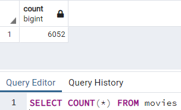
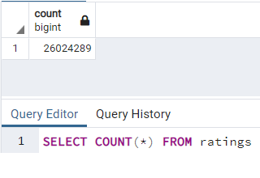

# Movies-ETL

## Project Overview
AmazingPrime Video is a platform which allows its users to stream movies and TV shows. The AmazingPrime Video team would like to develop an algorithm to predict which low-budget movies being released will become popular, so they can buy streaming rights to these movies.

In order to inspire the APV team, to have some fun, and as a means of connecting with the local coding community, AmazingPrime Video has decided to sponsor a hack-a-thon, providing a clean set of movie data and asking participants to predict the popular pictures.

This project successfully provides data sets for this hack-a-thon. There are two data sources: a scrape of Wikipedia for all movies released since 1990, and rating data from the MoviesLens website.

I extracted data from these two sources, transformed the data into one clean data set, and, finally, loaded this data set into a SQL table, where the data can be analyzed at the hack-a-thon.

## Resources
- Data Sources: wikipedia-movies.json, credits.csv, keywords.csv, links.csv, links_small.csv, movies_metadata.csv, ratings.csv, ratings_small.csv
- Software: pgAdmin 4 - PostgresSQL 11, Jupyter Notebook : 6.3.0, Visual Studio Code, 1.60.2

## Results
After accomplishing the extraction, transformation, and loading process of movie data from various sources into one source, the participants at the hack-a-thon are now able to analyze the data on their own in SQL. To show the sheer size of the data now available to the partipants, I've included references below.

First is a table of all of the movie information, merged cleanly from both Wikipedia and MoviesLens movie data. Here are the number of movies we have movie information on.

And here below is a count of the compilation of all of the different movie ratings and reviews, from the MoviesLens website.

